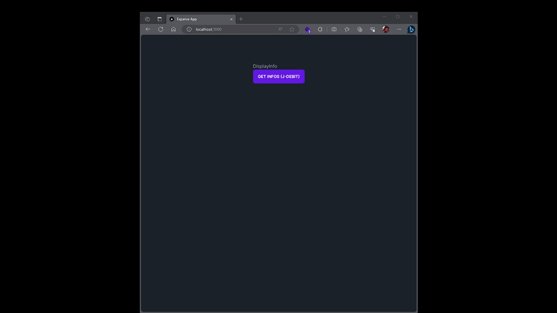

# Expense App

The goal of this app is to help me track my personal expenses and analyze my spending habits. I often struggle to keep track of my expenses, but fortunately, my debit card provides a CSV file that I can use to analyze my financial transactions.

ไว้ว่างๆ จะมาเขียนเพิ่ม ＞＜


## Demo




## Run Locally

Clone the project

```bash
  git clone https://link-to-project
```

Go to the project directory

```bash
  cd my-project
```

Install dependencies

```bash
  npm install
```

Start the server

```bash
  npm start 
```
Run as development

```bash
  npm run dev
```

## Tech Stack

**Client:** NextJs, React, TailwindCSS, [daisyui](https://daisyui.com/), [react-icons](https://react-icons.github.io/react-icons)

**Server:** Node v.18, Express


## 🚀 About Me
I'm a full stack developer... [newbie actually]

